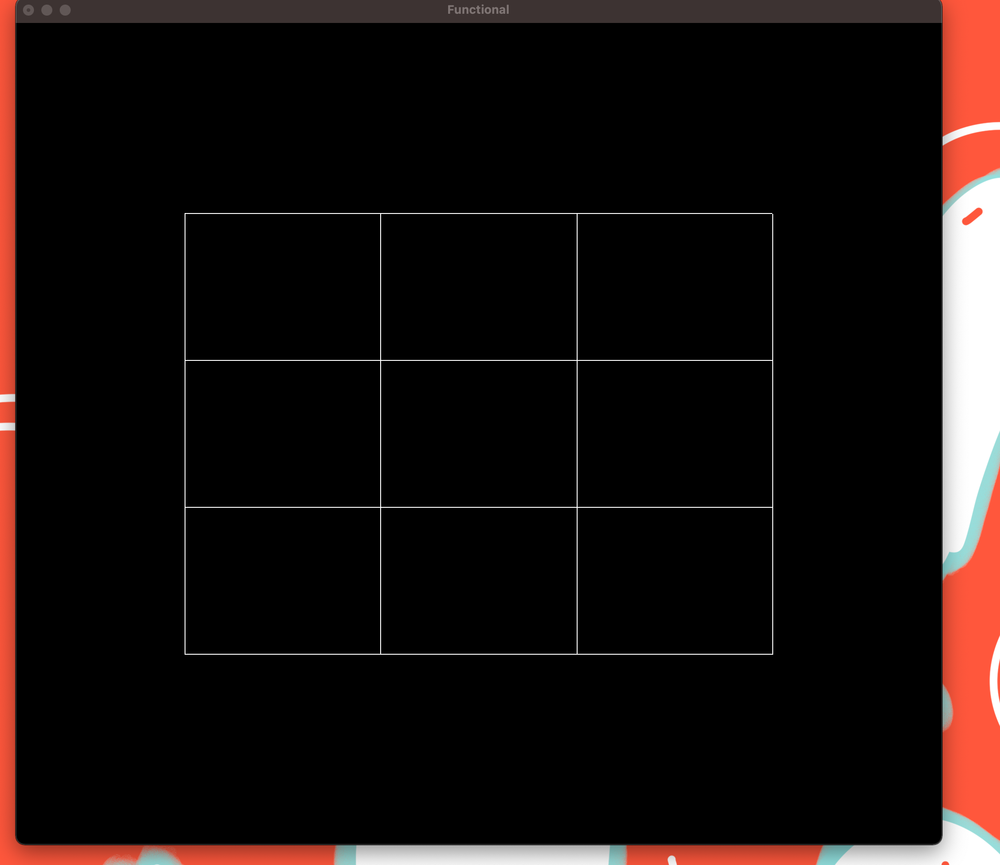
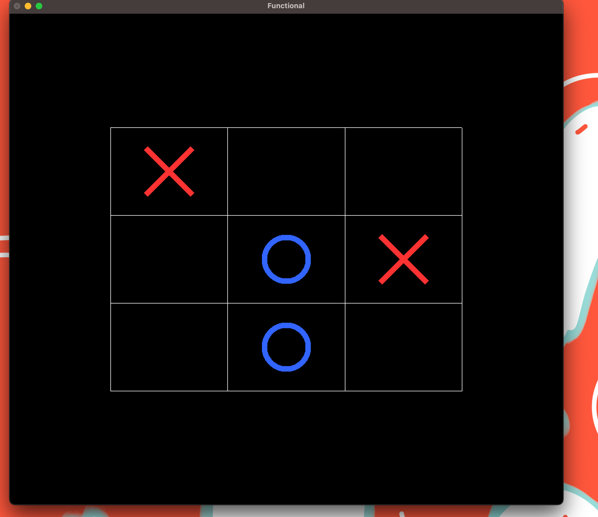
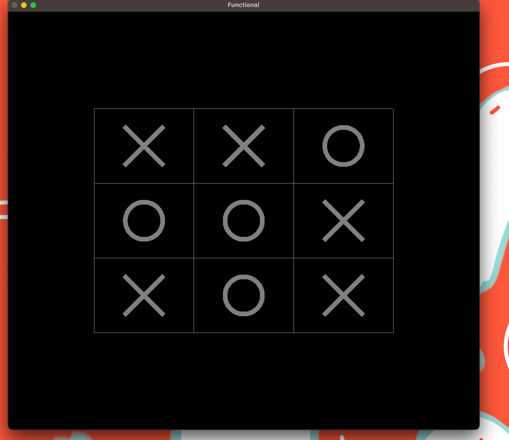

# Jogo da Velha

**Disciplina**: FGA0210 - PARADIGMAS DE PROGRAMAÇÃO - T01  
**Nro do Grupo**: 01 
**Paradigma**: Funcional 

## Alunos
|Matrícula | Aluno |
| -- | -- |
| 17/0039668  |  Lucas Ganda Carvalho |
| 15/0062567  |  Marcos Adriano Nery de Abrantes |
| 17/0047326  |  Wictor Bastos Girardi |
| 18/0028324  |  Thiago Luiz de Souza Gomes |

## Sobre 
O projeto consiste basicamente de um jogo da velha com uma interface grafica simples

## Screenshots

## Instalação 
**Linguagens**: Haskell 
**Tecnologias**: Stack 

* Para rodar o projeto, e necessario ter o `stack` instalado,  o tutorial de instalacao pode ser encontrado [aqui](https://docs.haskellstack.org/en/stable/install_and_upgrade/)
* Caso ocorra problema na execucao do projeto mesmo com o stack instalado, possivel e um erro envolvendo o `OpenGL\GLUT`, sendo necessario portanto uma instalacao manual do mesmo, algo relativamente simples
## Uso 

* Dependencias
> sudo apt install haskell-stack
> stack upgrade --binary-only

* Entrar na pasta do projeto 

* Buildar o projeto 
> Digite no Terminal `stack build`

* Em caso de erro com a biblioteca OpenGL 
> Digite no Terminal `sudo apt-get install freeglut3 freeglut3-dev`
> Digite no Terminal `stack build`

* Rode o projeto
> Digite no Terminal `stack exec trabalho-funcional`

## Vídeo
Apresentação [aqui](video/apresentacao.mp4)

## Fontes
* Instalação do OpenGL [aqui](https://stackoverflow.com/questions/28518168/missing-c-library-gl-when-installing-gloss-specifically-the-openglraw-depe)
